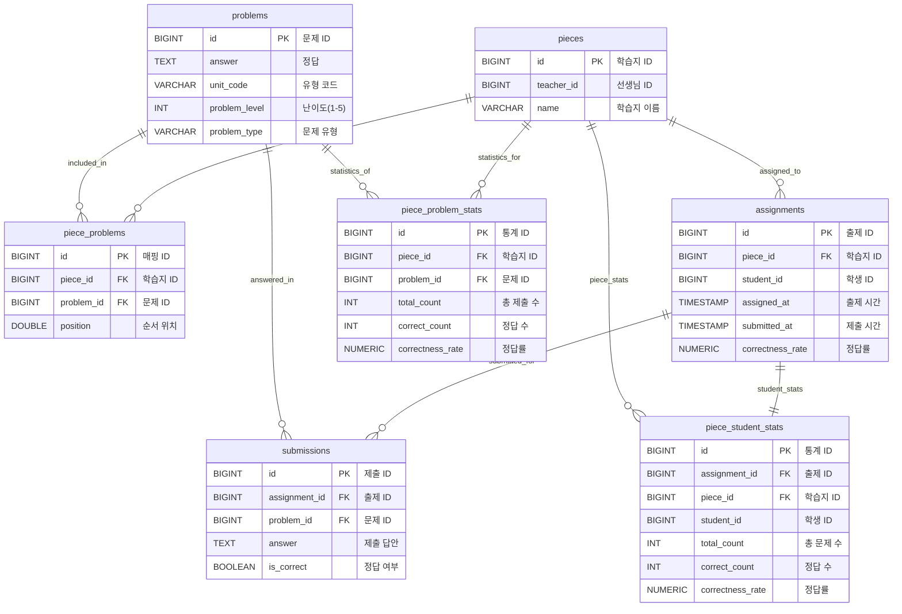

# 학습지 관리 시스템

## 프로젝트 개요

학습지 생성, 출제, 채점 및 분석을 위한 종합 관리 시스템입니다.

## 📋 주요 기능

- **학습지 관리**: 문제 선택 및 학습지 생성
- **출제 시스템**: 학생별 학습지 출제
- **자동 채점**: 답안 제출 시 실시간 채점
- **통계 분석**: 문제별/학생별 성과 분석

## 🛠 기술 스택

- **Backend**: Spring Boot 3.5.3, Kotlin 1.9.25
- **Database**: H2 Database (개발용)
- **Security**: Spring Security
- **Documentation**: Swagger/OpenAPI 3
- **Build Tool**: Gradle

## 🏃‍♂️ 실행 방법

### 1. 애플리케이션 실행

```bash
./gradlew bootRun
```

### 2. 접속 정보

- **애플리케이션**: http://localhost:8080
- **Swagger UI**: http://localhost:8080/swagger-ui.html
- **H2 Console**: http://localhost:8080/h2-console
  - JDBC URL: `jdbc:h2:mem:pulleydb`
  - Username: `sa`
  - Password: (비워두기)

## 📚 API 문서

### Swagger UI 접속

애플리케이션 실행 후 http://localhost:8080/swagger-ui.html 에서 API 문서를 확인할 수 있습니다.

### 주요 API 엔드포인트

#### 🎯 학습지 관리 (`/piece`)

- `POST /piece` - 학습지 생성 (선생님 전용)
- `GET /piece/{pieceId}/problems` - 학습지 문제 목록 조회
- `PATCH /piece/{pieceId}/order` - 문제 순서 수정 (선생님 전용)
- `GET /piece/{pieceId}/analysis` - 학습지 분석 (선생님 전용)

#### 📝 출제 및 채점 (`/piece/{pieceId}`)

- `POST /piece/{pieceId}` - 학습지 출제 (선생님 전용)
- `PUT /piece/{pieceId}/score` - 답안 제출 및 자동 채점

#### 🔍 문제 관리 (`/problems`)

- `GET /problems` - 문제 검색 (조건별 필터링)

### 인증 방식

모든 API는 헤더 기반 인증이 필요합니다.

헤더에 `X-User-Id` 와 UserId 값을 입력하고 요청합니다.

```bash
# 예시 요청
curl -H "Authorization: Bearer <your-jwt-token>" \
     -H "Content-Type: application/json" \
     http://localhost:8080/piece/1/problems
```

# 학습지 관리 시스템 데이터베이스 설계 문서

## 1. ERD (Entity Relationship Diagram)



## 2. 테이블별 설계 근거 및 분석

### 2.1 pieces (학습지) 테이블

```sql
CREATE TABLE pieces (
    id BIGINT GENERATED BY DEFAULT AS IDENTITY PRIMARY KEY,
    teacher_id BIGINT NOT NULL,
    name VARCHAR(100) NOT NULL
);
CREATE INDEX idx_teacher_id ON pieces (teacher_id);
```

**설계 근거**:

1. **데이터 타입 선정**:

   - `id`: `BIGINT` - 대용량 데이터 확장성 고려 (최대 9,223,372,036,854,775,807개)
   - `teacher_id`: `BIGINT` - 사용자 테이블과의 일관성 유지
   - `name`: `VARCHAR(100)` - 한글 기준 50자, UTF-8 인코딩 고려하여 충분한 길이

2. **인덱스 설계**:
   - `idx_teacher_id`: 선생님별 학습지 조회 최적화
   - 카디널리티가 높아 인덱스 효과 우수

**성능 고려사항**:

- 선생님당 평균 100개 학습지 가정 시, 인덱스 스캔으로 O(log n) 성능 보장

### 2.2 problems (문제) 테이블

```sql
CREATE TABLE problems (
    id BIGINT GENERATED BY DEFAULT AS IDENTITY PRIMARY KEY,
    answer TEXT NOT NULL,
    unit_code VARCHAR(10) NOT NULL,
    problem_level INT NOT NULL,
    problem_type VARCHAR(255) NOT NULL
);
CREATE INDEX idx_unit_code ON problems (unit_code);
CREATE INDEX idx_level ON problems (problem_level);
CREATE INDEX idx_problem_type ON problems (problem_type);
CREATE INDEX idx_unit_code_level_type ON problems (unit_code, problem_level, problem_type);
```

**설계 근거**:

1. **데이터 타입 선정**:

   - `answer`: `TEXT` - 긴 답안 지원 (수학 공식, 긴 서술형 답안)
   - `unit_code`: `VARCHAR(10)` - 'uc1234' 형태의 코드 체계
   - `problem_level`: `INT` - 1~5 범위, 향후 확장 가능성 고려
   - `problem_type`: `VARCHAR(255)` - ENUM 대신 VARCHAR 사용으로 유연성 확보

2. **인덱스 전략**:
   - **복합 인덱스 우선**: `idx_unit_code_level_type`가 대부분의 쿼리 커버
   - **단일 인덱스**: 개별 조건 검색 시 사용
   - **인덱스 순서**: 카디널리티 높은 순 (unit_code > problem_level > problem_type)

**쿼리 최적화 분석**:

```sql
-- 가장 빈번한 쿼리 패턴
SELECT * FROM problems
WHERE unit_code IN ('MATH_01', 'KOR_01')
  AND problem_level IN (1,2,3)
  AND problem_type = 'SELECTION'
ORDER BY unit_code, problem_level;
-- → idx_unit_code_level_type 인덱스로 최적화
```

### 2.3 piece_problems (학습지-문제 매핑) 테이블

```sql
CREATE TABLE piece_problems (
    id BIGINT GENERATED BY DEFAULT AS IDENTITY PRIMARY KEY,
    piece_id BIGINT NOT NULL,
    problem_id BIGINT NOT NULL,
    position DOUBLE NOT NULL,
    CONSTRAINT uk_piece_problem UNIQUE (piece_id, problem_id)
);
CREATE INDEX idx_piece_id ON piece_problems (piece_id);
CREATE INDEX idx_piece_position ON piece_problems (piece_id, position);
```

**설계 근거**:

1. **정규화 수준**:

   - 다대다 관계를 중간 테이블로 해결
   - 순서 정보(`position`)를 추가 속성으로 포함 (문제 순서 관리)

2. **순서 관리 전략**:

   - **현재**: `DOUBLE` 타입으로 중간값 삽입 방식
   - **개선 방향**: `VARCHAR` 타입으로 문자열 기반 Rank 시스템

3. **제약조건**:
   - `uk_piece_problem`: 동일 학습지에 같은 문제 중복 방지
   - 비즈니스 규칙을 데이터베이스 레벨에서 강제

**성능 최적화**:

```sql
-- 순서 변경 최적화를 위한 개선안
ALTER TABLE piece_problems MODIFY COLUMN position VARCHAR(50);

-- 문자열 기반 순서 관리 예시
-- 기존: 1.0, 2.0, 3.0 → 중간 삽입 시 1.5 (정밀도 한계)
-- 개선: "a", "b", "c" → 중간 삽입 시 "am" (무한 확장)
```

### 2.4 assignments (출제) 테이블

```sql
CREATE TABLE assignments (
    id BIGINT GENERATED BY DEFAULT AS IDENTITY PRIMARY KEY,
    piece_id BIGINT NOT NULL,
    student_id BIGINT NOT NULL,
    assigned_at TIMESTAMP NOT NULL,
    submitted_at TIMESTAMP,
    correctness_rate NUMERIC(5, 2),
    CONSTRAINT uk_assignments_piece_student UNIQUE (piece_id, student_id)
);
```

**설계 근거**:

1. **정규화 수준**:

   - 학습지와 학생의 다대다 관계 해결
   - 출제 시점과 제출 시점 분리 추적

2. **데이터 타입 선정**:

   - `assigned_at`: `TIMESTAMP` - 출제 시점 정확한 기록
   - `submitted_at`: `TIMESTAMP NULL` - 미제출 상태 허용
   - `correctness_rate`: `NUMERIC(5,2)` - 99.99% 까지 정밀도 보장

3. **비즈니스 규칙 반영**:
   - `uk_assignments_piece_student`: 동일 학습지 중복 출제 방지

**성능 고려사항**:

- 학생별 출제 이력 조회: `student_id` 인덱스 필요
- 학습지별 출제 현황 조회: `piece_id` 인덱스 필요

### 2.5 submissions (제출) 테이블

```sql
CREATE TABLE submissions (
    id BIGINT GENERATED BY DEFAULT AS IDENTITY PRIMARY KEY,
    assignment_id BIGINT NOT NULL,
    problem_id BIGINT NOT NULL,
    answer TEXT NOT NULL,
    is_correct BOOLEAN NOT NULL,
    CONSTRAINT uk_submissions_assignment_problem UNIQUE (assignment_id, problem_id)
);
CREATE INDEX idx_assignment_id ON submissions (assignment_id);
CREATE INDEX idx_problem_id ON submissions (problem_id);
CREATE INDEX idx_assignment_problem ON submissions (assignment_id, problem_id);
```

**설계 근거**:

1. **정규화 수준**:

   - 출제와 문제의 다대다 관계 해결
   - 제출 답안과 채점 결과 분리 저장

2. **데이터 타입 선정**:

   - `answer`: `TEXT` - 긴 서술형 답안 지원
   - `is_correct`: `BOOLEAN` - 정답/오답 구분

3. **제약조건**:
   - `uk_submissions_assignment_problem`: 동일 문제 중복 제출 방지
   - 한 번 제출한 답안은 수정 불가 정책 반영

**쿼리 패턴 분석**:

```sql
-- 학생별 제출 현황 조회
SELECT * FROM submissions WHERE assignment_id = ?;
-- → idx_assignment_id 사용

-- 문제별 정답률 분석
SELECT problem_id, AVG(CASE WHEN is_correct THEN 1.0 ELSE 0.0 END)
FROM submissions WHERE assignment_id IN (SELECT id FROM assignments WHERE piece_id = ?)
GROUP BY problem_id;
-- → idx_assignment_problem 복합 인덱스 활용
```

### 2.6 통계 테이블 설계

#### 2.6.1 piece_problem_stats (문제별 통계)

```sql
CREATE TABLE piece_problem_stats (
    id BIGINT GENERATED BY DEFAULT AS IDENTITY PRIMARY KEY,
    piece_id BIGINT NOT NULL,
    problem_id BIGINT NOT NULL,
    total_count INT NOT NULL,
    correct_count INT NOT NULL,
    correctness_rate NUMERIC(5, 2) NOT NULL,
    CONSTRAINT uk_piece_problem_stats_piece_problem UNIQUE (piece_id, problem_id)
);
```

**설계 근거**:

1. **비정규화 선택 이유**:

   - 실시간 집계 쿼리의 성능 문제 해결
   - 학생 100명 × 문제 50개 = 5,000개 레코드 집계 → 50개 레코드 조회로 최적화

2. **중복 데이터 허용**:

   - `correctness_rate`는 `correct_count/total_count`로 계산 가능하지만 성능을 위해 저장
   - 업데이트 시 일관성 유지 필요

3. **동시성 고려**:
   - 여러 학생의 동시 제출로 인한 경합 상황 발생 가능
   - 비관적 락 또는 원자적 업데이트 필요

#### 2.6.2 piece_student_stats (학생별 통계)

```sql
CREATE TABLE piece_student_stats (
    id BIGINT GENERATED BY DEFAULT AS IDENTITY PRIMARY KEY,
    assignment_id BIGINT NOT NULL UNIQUE,
    piece_id BIGINT NOT NULL,
    student_id BIGINT NOT NULL,
    total_count INT NOT NULL,
    correct_count INT NOT NULL,
    correctness_rate NUMERIC(5, 2) NOT NULL,
    CONSTRAINT uk_piece_student_stats_piece_student UNIQUE (piece_id, student_id)
);
```

**설계 근거**:

1. **assignment_id 참조**:

   - 1:1 관계로 정규화 유지
   - 출제 정보와 통계 정보 연결

2. **이중 UNIQUE 제약조건**:
   - `assignment_id`: 출제당 하나의 통계
   - `(piece_id, student_id)`: 학습지-학생 조합의 유일성

## 3. 인덱스 최적화 전략

### 3.1 현재 인덱스 분석

**효율적인 인덱스**:

- `problems.idx_unit_code_level_type`: 복합 조건 쿼리 최적화
- `piece_problems.idx_piece_position`: 순서 정렬 쿼리 최적화

**개선 필요한 인덱스**:

```sql
-- 중복 인덱스 제거 (복합 인덱스가 단일 인덱스 역할 포함)
DROP INDEX idx_unit_code ON problems;
DROP INDEX idx_level ON problems;
DROP INDEX idx_problem_type ON problems;

-- 필요한 인덱스 추가
CREATE INDEX idx_assignments_student_id ON assignments (student_id);
CREATE INDEX idx_submissions_problem_correct ON submissions (problem_id, is_correct);
```

---

## 성능 및 비용 최적화

### 1. 이미 구현된 최적화 사항

#### 1.1 데이터베이스 인덱스 최적화

**구현된 인덱스**:

```sql
-- problems 테이블 복합 인덱스
CREATE INDEX idx_unit_code_level_type ON problems (unit_code, problem_level, problem_type);

-- piece_problems 테이블 순서 정렬 인덱스
CREATE INDEX idx_piece_position ON piece_problems (piece_id, position);

-- 사용자 테이블 고유 인덱스
CREATE UNIQUE INDEX idx_users_username ON users (username);
CREATE UNIQUE INDEX idx_users_email ON users (email);
```

**성능 효과**:

- 문제 조회 시 복합 조건 필터링 성능 향상
- 학습지 문제 정렬 성능 향상

#### 1.2 통계 테이블 사전 구축

**구현된 통계 테이블**:

```kotlin
// 문제별 통계 테이블
data class PieceProblemStat(
    val pieceId: PieceId,
    val problemId: ProblemId,
    val totalCount: Int,
    val correctCount: Int,
    val correctnessRate: CorrectnessRate
)

// 학생별 통계 테이블
data class PieceStudentStat(
    val assignmentId: AssignmentId,
    val pieceId: PieceId,
    val studentId: StudentId,
    val totalCount: Int,
    val correctCount: Int,
    val correctnessRate: CorrectnessRate
)
```

**성능 효과**:

- 통계 조회 시 집계 연산 제거로 응답 시간 단축
- 이벤트 기반 업데이트로 응답 지연 감소 DB 부하 감소

#### 1.3 이벤트 기반 비동기 처리

**구현된 이벤트 시스템**:

```kotlin
// 이벤트 처리
@Component
class StatisticsEventHandler {
    @EventListener
    fun handleSubmissionGraded(event: SubmissionGradedEvent) {
        statisticsUpdateService.updateStatistics(event)
    }
}
```

**성능 효과**:

- 채점 API 응답 시간 단축 (통계 업데이트 비동기 분리)
- 시스템 확장성 향상

#### 1.4 JPA 최적화 설정

**적용된 설정**:

```yaml
# application.yml
spring:
  jpa:
    properties:
      hibernate:
        jdbc:
          batch_size: 20 # 배치 처리 최적화
    open-in-view: false # 불필요한 지연 로딩 방지
```

### 2. 추가 개선 방안

#### 2.1 캐싱 전략 도입

**Redis 기반 캐싱**:

```kotlin
@Service
class ProblemService {
    @Cacheable(
        value = ["problems"],
        key = "#unitCodes?.toString() + '_' + #level + '_' + #problemType"
    )
    fun searchProblems(
        unitCodes: List<String>?,
        level: String?,
        problemType: String?
    ): List<Problem> {
        return problemRepository.findByConditions(unitCodes, level, problemType)
    }
}

@CacheEvict(value = ["problems"], allEntries = true)
fun clearProblemCache() {
    // 문제 데이터 변경 시 캐시 무효화
}
```

**예상 효과**:

- 반복 조회 시 응답 시간 단축
- DB 부하 감소

#### 2.2 커넥션 풀 최적화

**HikariCP 설정 개선**:

```yaml
spring:
  datasource:
    hikari:
      maximum-pool-size: 20
      minimum-idle: 5
      connection-timeout: 20000
      idle-timeout: 300000
      max-lifetime: 1200000
      leak-detection-threshold: 60000
```

**예상 효과**:

- 동시 접속자 증가 시 DB 연결 대기 시간 감소

#### 2.3 페이징 처리 도입

**대용량 데이터 처리 최적화**:

```kotlin
@GetMapping("/problems")
fun getProblems(
    @RequestParam(defaultValue = "0") page: Int,
    @RequestParam(defaultValue = "20") size: Int,
    @RequestParam unitCodes: List<String>?
): Page<ProblemResponse> {
    val pageable = PageRequest.of(page, size)
    return problemService.findProblems(pageable, unitCodes)
        .map { ProblemResponse.from(it) }
}
```

**예상 효과**:

- 메모리 사용량 감소
- 초기 로딩 시간 단축

---

## 🔄 학습지 순서 변경 로직 최적화

### 1. 현재 구현 및 문제점

#### 1.1 현재 Double 기반 Position 시스템

**현재 구현**:

```kotlin
// Position.kt - 부동소수점 기반 중간값 계산
companion object {
    fun between(before: Position?, after: Position?): Position {
        return when {
            before == null && after == null -> Position(1.0)
            before == null -> Position(after!!.value / 2.0)
            after == null -> Position(before.value + 1.0)
            else -> Position((before.value + after.value) / 2.0)  // 정밀도 손실 지점
        }
    }
}
```

**현재 순서 변경 서비스**:

```kotlin
// PieceOrderUpdateService.kt
fun updateProblemOrder(command: ProblemOrderUpdateCommand): ProblemOrderUpdateResult {
    val updatedProblem = problemToMove.moveTo(prevProblem, nextProblem)
    pieceProblemRepository.save(updatedProblem)
    return ProblemOrderUpdateResult(/* ... */)
}
```

#### 1.2 현재 시스템의 문제점

**1. 정밀도 한계**:

- 반복적인 중간값 계산으로 `1.0` → `1.5` → `1.25` → `1.125` → ...
- 부동소수점 정밀도 한계에 도달하면 순서 변경 불가

**2. 리밸런싱 메커니즘 부재**:

- 정밀도 한계 도달 시 자동 리밸런싱 로직 없음
- 수동 개입 필요

**3. 클라이언트-서버 통신 비효율**:

- 현재는 최적화되어 있지만, 정밀도 문제로 인한 잠재적 이슈

### 2. 권장 개선방안

#### 2.1 문자열 기반 Rank 시스템 도입

**개선된 Position 구조**:

```kotlin
// 기존 Double 타입을 String 타입으로 변경
data class Position(val value: String) {

    companion object {
        private val CHARS = "0123456789ABCDEFGHIJKLMNOPQRSTUVWXYZabcdefghijklmnopqrstuvwxyz"

        fun between(before: Position?, after: Position?): Position {
            return when {
                before == null && after == null -> Position("n") // 중간값
                before == null -> Position(generateBefore(after!!.value))
                after == null -> Position(generateAfter(before!!.value))
                else -> Position(generateMiddle(before.value, after.value))
            }
        }

        private fun generateMiddle(prev: String, next: String): String {
            // Base62 기반 중간값 계산 - 무한 확장 가능
            val prevChars = prev.toCharArray()
            val nextChars = next.toCharArray()

            // 두 문자열 사이의 사전순 중간값 생성
            return calculateLexicographicMiddle(prevChars, nextChars)
        }
    }
}
```

---

## 잠재적 위험요소 및 해결방안

#### 1.통계 테이블 동시성 문제

**위험요소**:

- `piece_problem_stats` 테이블이 여러 학생의 동시 제출에 의해 업데이트될 때 데이터 불일치 발생 가능
- Race Condition으로 인한 통계 데이터 손실

**현재 코드의 문제점**:

```kotlin
// StatisticsUpdateService.kt - 동시성 이슈 발생 지점
val existingStat = pieceProblemStatRepository.findByPieceIdAndProblemId(event.pieceId, problemId)
val updatedStat = if (existingStat != null) {
    // 기존 통계에 증분 추가 - 동시성 문제 발생
    existingStat.update(
        existingStat.totalCount + problemStats.totalCount,
        existingStat.correctCount + problemStats.correctCount
    )
}
```

**해결방안**:

1. **비관적 락 (Pessimistic Lock) 적용**

```kotlin
@Lock(LockModeType.PESSIMISTIC_WRITE)
@Query("SELECT p FROM PieceProblemStatJpaEntity p WHERE p.pieceId = :pieceId AND p.problemId = :problemId")
fun findByPieceIdAndProblemIdForUpdate(pieceId: Long, problemId: Long): PieceProblemStatJpaEntity?
```

2. **원자적 업데이트 쿼리 사용**

```kotlin
@Modifying
@Query("""
    UPDATE PieceProblemStatJpaEntity p
    SET p.totalCount = p.totalCount + :increment,
        p.correctCount = p.correctCount + :correctIncrement,
        p.correctnessRate = (p.correctCount + :correctIncrement) / (p.totalCount + :increment)
    WHERE p.pieceId = :pieceId AND p.problemId = :problemId
""")
fun incrementCounts(pieceId: Long, problemId: Long, increment: Int, correctIncrement: Int)
```

#### 2. N+1 쿼리 문제

**위험요소**:

- `ProblemSearchService`에서 각 난이도별로 별도 쿼리 실행
- 대량 데이터 조회 시 성능 저하

**현재 문제 코드**:

```kotlin
// ProblemSearchService.kt - 각 난이도별 개별 쿼리
val lowProblems = problemRepository.findByConditions(
    unitCodes = query.unitCodeList,
    problemType = domainProblemType,
    levels = Level.LOW.levels,
    limit = distributionPlan.lowCount
)
val middleProblems = problemRepository.findByConditions(...) // 추가 쿼리
val highProblems = problemRepository.findByConditions(...)   // 추가 쿼리
```

**해결방안**:

1. **단일 쿼리로 통합**

```kotlin
@Query("""
    SELECT p FROM ProblemJpaEntity p
    WHERE p.unitCode IN :unitCodes
    AND (:problemType IS NULL OR p.problemType = :problemType)
    ORDER BY p.level ASC, FUNCTION('RAND')
""")
fun findAllByConditionsWithRandomOrder(
    unitCodes: List<String>,
    problemType: ProblemType?
): List<ProblemJpaEntity>
```

2. **애플리케이션 레벨에서 분배**

```kotlin
fun searchProblems(query: ProblemSearchQuery): ProblemSearchResult {
    val allProblems = problemRepository.findAllByConditionsWithRandomOrder(
        query.unitCodeList, query.problemType
    )

    return LevelDistribution.fromLevel(query.level)
        .distribute(allProblems, query.totalCount)
}
```

---
