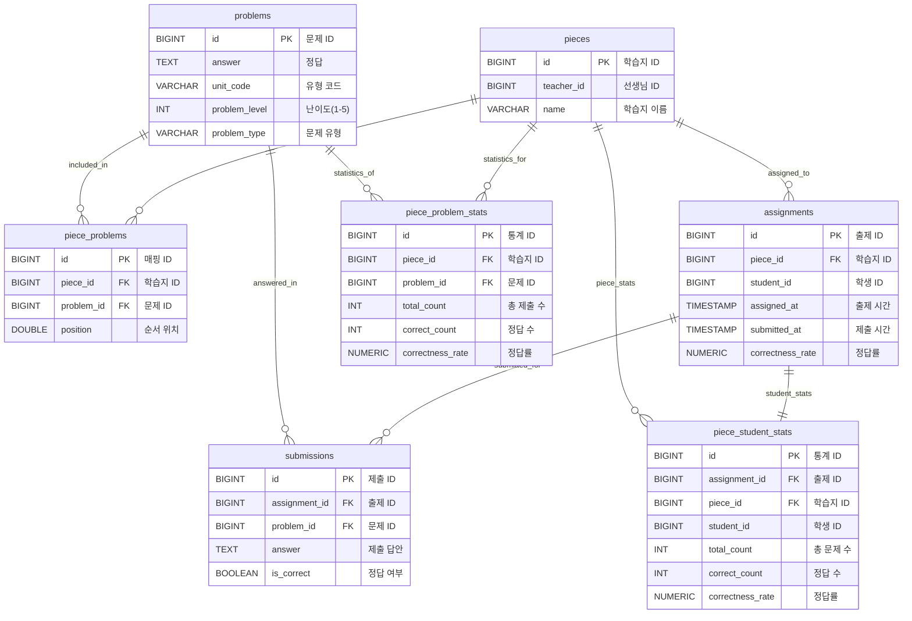

# 학습지 관리 시스템 데이터베이스 설계 문서

## 1. ERD (Entity Relationship Diagram)



## 2. 테이블별 설계 근거 및 분석

### 2.1 pieces (학습지) 테이블

```sql
CREATE TABLE pieces (
    id BIGINT GENERATED BY DEFAULT AS IDENTITY PRIMARY KEY,
    teacher_id BIGINT NOT NULL,
    name VARCHAR(100) NOT NULL
);
CREATE INDEX idx_teacher_id ON pieces (teacher_id);
```

**설계 근거**:


1. **데이터 타입 선정**:

    - `id`: `BIGINT` - 대용량 데이터 확장성 고려 (최대 9,223,372,036,854,775,807개)
    - `teacher_id`: `BIGINT` - 사용자 테이블과의 일관성 유지
    - `name`: `VARCHAR(100)` - 한글 기준 50자, UTF-8 인코딩 고려하여 충분한 길이

2. **인덱스 설계**:
    - `idx_teacher_id`: 선생님별 학습지 조회 최적화
    - 카디널리티가 높아 인덱스 효과 우수

**성능 고려사항**:

- 선생님당 평균 100개 학습지 가정 시, 인덱스 스캔으로 O(log n) 성능 보장

### 2.2 problems (문제) 테이블

```sql
CREATE TABLE problems (
    id BIGINT GENERATED BY DEFAULT AS IDENTITY PRIMARY KEY,
    answer TEXT NOT NULL,
    unit_code VARCHAR(10) NOT NULL,
    problem_level INT NOT NULL,
    problem_type VARCHAR(255) NOT NULL
);
CREATE INDEX idx_unit_code ON problems (unit_code);
CREATE INDEX idx_level ON problems (problem_level);
CREATE INDEX idx_problem_type ON problems (problem_type);
CREATE INDEX idx_unit_code_level_type ON problems (unit_code, problem_level, problem_type);
```

**설계 근거**:

1. **데이터 타입 선정**:

    - `answer`: `TEXT` - 긴 답안 지원 (수학 공식, 긴 서술형 답안)
    - `unit_code`: `VARCHAR(10)` - 'uc1234' 형태의 코드 체계
    - `problem_level`: `INT` - 1~5 범위, 향후 확장 가능성 고려
    - `problem_type`: `VARCHAR(255)` - ENUM 대신 VARCHAR 사용으로 유연성 확보

3. **인덱스 전략**:
    - **복합 인덱스 우선**: `idx_unit_code_level_type`가 대부분의 쿼리 커버
    - **단일 인덱스**: 개별 조건 검색 시 사용
    - **인덱스 순서**: 카디널리티 높은 순 (unit_code > problem_level > problem_type)

**쿼리 최적화 분석**:

```sql
-- 가장 빈번한 쿼리 패턴
SELECT * FROM problems
WHERE unit_code IN ('MATH_01', 'KOR_01')
  AND problem_level IN (1,2,3)
  AND problem_type = 'SELECTION'
ORDER BY unit_code, problem_level;
-- → idx_unit_code_level_type 인덱스로 최적화
```

### 2.3 piece_problems (학습지-문제 매핑) 테이블

```sql
CREATE TABLE piece_problems (
    id BIGINT GENERATED BY DEFAULT AS IDENTITY PRIMARY KEY,
    piece_id BIGINT NOT NULL,
    problem_id BIGINT NOT NULL,
    position DOUBLE NOT NULL,
    CONSTRAINT uk_piece_problem UNIQUE (piece_id, problem_id)
);
CREATE INDEX idx_piece_id ON piece_problems (piece_id);
CREATE INDEX idx_piece_position ON piece_problems (piece_id, position);
```

**설계 근거**:

1. **정규화 수준**:

    - 다대다 관계를 중간 테이블로 해결
    - 순서 정보(`position`)를 추가 속성으로 포함 (문제 순서 관리)

2. **순서 관리 전략**:

    - **현재**: `DOUBLE` 타입으로 중간값 삽입 방식
    - **개선 방향**: `VARCHAR` 타입으로 문자열 기반 Rank 시스템

3. **제약조건**:
    - `uk_piece_problem`: 동일 학습지에 같은 문제 중복 방지
    - 비즈니스 규칙을 데이터베이스 레벨에서 강제

**성능 최적화**:

```sql
-- 순서 변경 최적화를 위한 개선안
ALTER TABLE piece_problems MODIFY COLUMN position VARCHAR(50);

-- 문자열 기반 순서 관리 예시
-- 기존: 1.0, 2.0, 3.0 → 중간 삽입 시 1.5 (정밀도 한계)
-- 개선: "a", "b", "c" → 중간 삽입 시 "am" (무한 확장)
```

### 2.4 assignments (출제) 테이블

```sql
CREATE TABLE assignments (
    id BIGINT GENERATED BY DEFAULT AS IDENTITY PRIMARY KEY,
    piece_id BIGINT NOT NULL,
    student_id BIGINT NOT NULL,
    assigned_at TIMESTAMP NOT NULL,
    submitted_at TIMESTAMP,
    correctness_rate NUMERIC(5, 2),
    CONSTRAINT uk_assignments_piece_student UNIQUE (piece_id, student_id)
);
```

**설계 근거**:

1. **정규화 수준**:

    - 학습지와 학생의 다대다 관계 해결
    - 출제 시점과 제출 시점 분리 추적

2. **데이터 타입 선정**:

    - `assigned_at`: `TIMESTAMP` - 출제 시점 정확한 기록
    - `submitted_at`: `TIMESTAMP NULL` - 미제출 상태 허용
    - `correctness_rate`: `NUMERIC(5,2)` - 99.99% 까지 정밀도 보장

3. **비즈니스 규칙 반영**:
    - `uk_assignments_piece_student`: 동일 학습지 중복 출제 방지

**성능 고려사항**:

- 학생별 출제 이력 조회: `student_id` 인덱스 필요
- 학습지별 출제 현황 조회: `piece_id` 인덱스 필요

### 2.5 submissions (제출) 테이블

```sql
CREATE TABLE submissions (
    id BIGINT GENERATED BY DEFAULT AS IDENTITY PRIMARY KEY,
    assignment_id BIGINT NOT NULL,
    problem_id BIGINT NOT NULL,
    answer TEXT NOT NULL,
    is_correct BOOLEAN NOT NULL,
    CONSTRAINT uk_submissions_assignment_problem UNIQUE (assignment_id, problem_id)
);
CREATE INDEX idx_assignment_id ON submissions (assignment_id);
CREATE INDEX idx_problem_id ON submissions (problem_id);
CREATE INDEX idx_assignment_problem ON submissions (assignment_id, problem_id);
```

**설계 근거**:

1. **정규화 수준**:

    - 출제와 문제의 다대다 관계 해결
    - 제출 답안과 채점 결과 분리 저장

2. **데이터 타입 선정**:

    - `answer`: `TEXT` - 긴 서술형 답안 지원
    - `is_correct`: `BOOLEAN` - 정답/오답 구분

3. **제약조건**:
    - `uk_submissions_assignment_problem`: 동일 문제 중복 제출 방지
    - 한 번 제출한 답안은 수정 불가 정책 반영

**쿼리 패턴 분석**:

```sql
-- 학생별 제출 현황 조회
SELECT * FROM submissions WHERE assignment_id = ?;
-- → idx_assignment_id 사용

-- 문제별 정답률 분석
SELECT problem_id, AVG(CASE WHEN is_correct THEN 1.0 ELSE 0.0 END)
FROM submissions WHERE assignment_id IN (SELECT id FROM assignments WHERE piece_id = ?)
GROUP BY problem_id;
-- → idx_assignment_problem 복합 인덱스 활용
```

### 2.6 통계 테이블 설계

#### 2.6.1 piece_problem_stats (문제별 통계)

```sql
CREATE TABLE piece_problem_stats (
    id BIGINT GENERATED BY DEFAULT AS IDENTITY PRIMARY KEY,
    piece_id BIGINT NOT NULL,
    problem_id BIGINT NOT NULL,
    total_count INT NOT NULL,
    correct_count INT NOT NULL,
    correctness_rate NUMERIC(5, 2) NOT NULL,
    CONSTRAINT uk_piece_problem_stats_piece_problem UNIQUE (piece_id, problem_id)
);
```

**설계 근거**:

1. **비정규화 선택 이유**:

    - 실시간 집계 쿼리의 성능 문제 해결
    - 학생 100명 × 문제 50개 = 5,000개 레코드 집계 → 50개 레코드 조회로 최적화

2. **중복 데이터 허용**:

    - `correctness_rate`는 `correct_count/total_count`로 계산 가능하지만 성능을 위해 저장
    - 업데이트 시 일관성 유지 필요

3. **동시성 고려**:
    - 여러 학생의 동시 제출로 인한 경합 상황 발생 가능
    - 비관적 락 또는 원자적 업데이트 필요

#### 2.6.2 piece_student_stats (학생별 통계)

```sql
CREATE TABLE piece_student_stats (
    id BIGINT GENERATED BY DEFAULT AS IDENTITY PRIMARY KEY,
    assignment_id BIGINT NOT NULL UNIQUE,
    piece_id BIGINT NOT NULL,
    student_id BIGINT NOT NULL,
    total_count INT NOT NULL,
    correct_count INT NOT NULL,
    correctness_rate NUMERIC(5, 2) NOT NULL,
    CONSTRAINT uk_piece_student_stats_piece_student UNIQUE (piece_id, student_id)
);
```

**설계 근거**:

1. **assignment_id 참조**:

    - 1:1 관계로 정규화 유지
    - 출제 정보와 통계 정보 연결

2. **이중 UNIQUE 제약조건**:
    - `assignment_id`: 출제당 하나의 통계
    - `(piece_id, student_id)`: 학습지-학생 조합의 유일성

## 3. 인덱스 최적화 전략

### 3.1 현재 인덱스 분석

**효율적인 인덱스**:

- `problems.idx_unit_code_level_type`: 복합 조건 쿼리 최적화
- `piece_problems.idx_piece_position`: 순서 정렬 쿼리 최적화

**개선 필요한 인덱스**:

```sql
-- 중복 인덱스 제거 (복합 인덱스가 단일 인덱스 역할 포함)
DROP INDEX idx_unit_code ON problems;
DROP INDEX idx_level ON problems;
DROP INDEX idx_problem_type ON problems;

-- 필요한 인덱스 추가
CREATE INDEX idx_assignments_student_id ON assignments (student_id);
CREATE INDEX idx_submissions_problem_correct ON submissions (problem_id, is_correct);
```
